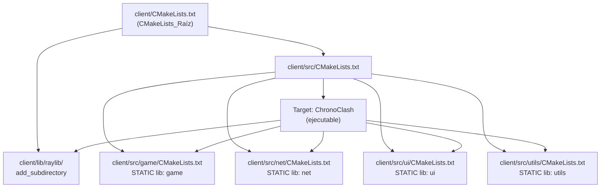
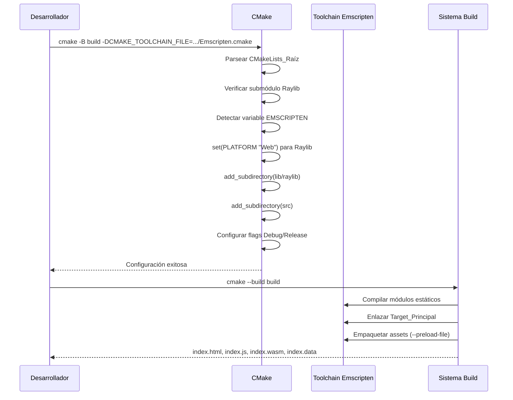
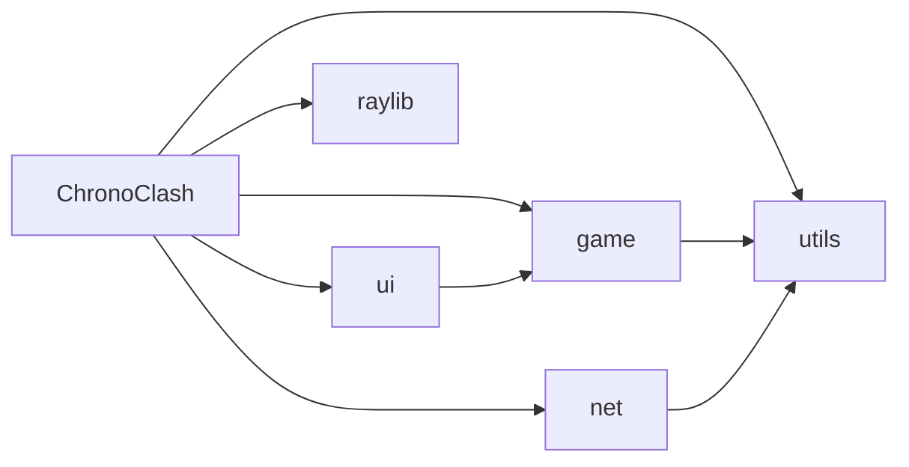

# Documento de Diseño: cmake-project-setup

## Resumen

Este documento describe el diseño técnico para migrar el sistema de build del cliente ChronoClash de un Makefile a CMake. El diseño establece una jerarquía modular de archivos CMakeLists.txt que orquesta la compilación de módulos estáticos (game, net, ui, utils), integra Raylib como submódulo, y produce artefactos WebAssembly mediante el toolchain de Emscripten.

La migración utiliza CMake 3.15+ con prácticas modernas: targets con propiedades, propagación transitiva de dependencias via `target_link_libraries`, y generator expressions para configuración condicional Debug/Release.

---

## Arquitectura

### Jerarquía de archivos CMake



### Flujo de configuración y compilación



---

## Componentes e Interfaces

### 1. CMakeLists_Raíz (client/CMakeLists.txt)

**Responsabilidad:** Orquestar la configuración global del proyecto.

**Contenido clave:**

```cmake
cmake_minimum_required(VERSION 3.15)
project(ChronoClash LANGUAGES CXX)

# Estándar C++17 obligatorio
set(CMAKE_CXX_STANDARD 17)
set(CMAKE_CXX_STANDARD_REQUIRED ON)
set(CMAKE_CXX_EXTENSIONS OFF)

# Verificar submódulo Raylib
if(NOT EXISTS "${CMAKE_CURRENT_SOURCE_DIR}/lib/raylib/CMakeLists.txt")
    message(FATAL_ERROR
        "El submódulo de Raylib no está inicializado.\n"
        "Ejecuta: git submodule update --init --recursive"
    )
endif()

# Configuración de Raylib para Emscripten
if(EMSCRIPTEN)
    set(PLATFORM "Web" CACHE STRING "" FORCE)
endif()

add_subdirectory(lib/raylib)
add_subdirectory(src)
```

**Decisiones de diseño:**
- `cmake_minimum_required(VERSION 3.15)` — garantiza soporte de generator expressions y `CMAKE_CXX_STANDARD` como target property.
- La verificación del submódulo usa `FATAL_ERROR` para dar un mensaje claro antes de que CMake falle con errores crípticos de directorio inexistente.
- `PLATFORM` se configura como variable CACHE con FORCE para que Raylib la detecte internamente cuando se procesa su CMakeLists.txt.

### 2. CMakeLists.txt de src/ (client/src/CMakeLists.txt)

**Responsabilidad:** Registrar submódulos y definir el target ejecutable principal.

```cmake
# Registrar módulos
add_subdirectory(game)
add_subdirectory(net)
add_subdirectory(ui)
add_subdirectory(utils)

# Target principal
add_executable(ChronoClash main.cpp)

target_link_libraries(ChronoClash PRIVATE
    game
    net
    ui
    utils
    raylib
)

# Configuración específica de Emscripten
if(EMSCRIPTEN)
    set_target_properties(ChronoClash PROPERTIES
        SUFFIX ".html"
        OUTPUT_NAME "index"
    )

    target_link_options(ChronoClash PRIVATE
        "-sUSE_GLFW=3"
        "-sASYNCIFY"
        "-sALLOW_MEMORY_GROWTH=1"
        "-lwebsocket.js"
        "--preload-file=${CMAKE_CURRENT_SOURCE_DIR}/../assets@/assets"
        "--shell-file=${CMAKE_CURRENT_SOURCE_DIR}/shell.html"
    )

    # Flags Debug específicos de Emscripten
    target_link_options(ChronoClash PRIVATE
        "$<$<CONFIG:Debug>:-sASSERTIONS=1>"
        "$<$<CONFIG:Debug>:-gsource-map>"
        "$<$<CONFIG:Release>:--closure=1>"
    )
endif()

# Warnings para código del proyecto
target_compile_options(ChronoClash PRIVATE -Wall -Wextra)

# Flags de optimización por configuración
target_compile_options(ChronoClash PRIVATE
    "$<$<CONFIG:Debug>:-O0;-g>"
    "$<$<CONFIG:Release>:-O2>"
)
```

**Decisiones de diseño:**
- El target se denomina `ChronoClash` internamente; `OUTPUT_NAME "index"` + `SUFFIX ".html"` produce `index.html` que Emscripten expande a `.html`, `.js`, `.wasm`, `.data`.
- `--preload-file` usa la sintaxis `ruta_real@ruta_virtual` para que los assets se encuentren en `/assets` dentro del filesystem virtual de Emscripten.
- Los flags de enlace Emscripten se aplican con `target_link_options` (CMake 3.13+) en lugar de manipular `CMAKE_EXE_LINKER_FLAGS`.
- Generator expressions `$<$<CONFIG:...>:...>` separan flags de Debug y Release sin recurrir a variables globales.

### 3. CMakeLists.txt de módulos (patrón repetible)

**Patrón para cada módulo** (ejemplo: `client/src/game/CMakeLists.txt`):

```cmake
add_library(game STATIC
    game.cpp
    player.cpp
    ability.cpp
    level.cpp
    hazards.cpp
    camera.cpp
)

target_include_directories(game PUBLIC
    ${CMAKE_CURRENT_SOURCE_DIR}
)

target_link_libraries(game PUBLIC
    utils
)

# Warnings para el módulo
target_compile_options(game PRIVATE -Wall -Wextra)
```

**Patrón para `net/`:**

```cmake
add_library(net STATIC
    net.cpp
    messages.cpp
)

target_include_directories(net PUBLIC
    ${CMAKE_CURRENT_SOURCE_DIR}
)

target_link_libraries(net PUBLIC
    utils
)

target_compile_options(net PRIVATE -Wall -Wextra)
```

**Patrón para `ui/`:**

```cmake
add_library(ui STATIC
    ui.cpp
    screens.cpp
)

target_include_directories(ui PUBLIC
    ${CMAKE_CURRENT_SOURCE_DIR}
)

target_link_libraries(ui PUBLIC
    game
)

target_compile_options(ui PRIVATE -Wall -Wextra)
```

**Patrón para `utils/`:**

```cmake
add_library(utils STATIC
    # utils es header-only por ahora, pero se declara como INTERFACE
    # o STATIC con un archivo placeholder si se requieren fuentes futuras
)

# Si utils es header-only:
add_library(utils INTERFACE)
target_include_directories(utils INTERFACE
    ${CMAKE_CURRENT_SOURCE_DIR}
)
```

**Decisiones de diseño:**
- `target_include_directories(... PUBLIC ...)` propaga las rutas de inclusión transitivamente a cualquier target que enlace contra este módulo.
- Las dependencias inter-módulo se declaran con `target_link_libraries(... PUBLIC ...)` para que la propagación transitiva resuelva automáticamente los headers de dependencias indirectas.
- Las fuentes se listan explícitamente (sin `file(GLOB ...)`) para que CMake detecte cambios cuando se agregan/eliminan archivos.
- Los warnings `-Wall -Wextra` se aplican per-target con `PRIVATE` para no propagarlos a dependencias externas (como Raylib).

### 4. Integración de Raylib

**Mecanismo:** `add_subdirectory(lib/raylib)` en el CMakeLists_Raíz.

Raylib expone el target `raylib` con sus rutas de inclusión configuradas. Al enlazar con `target_link_libraries(ChronoClash PRIVATE raylib)`, los headers de Raylib (en `lib/raylib/src/`) quedan disponibles automáticamente sin `include_directories` adicionales.

La variable `PLATFORM` se configura a `"Web"` únicamente cuando se detecta la compilación con Emscripten, permitiendo que Raylib se configure correctamente para OpenGL ES 2.0 / WebGL.

---

## Modelos de Datos

### Estructura de archivos generados

| Archivo | Ubicación | Descripción |
|---------|-----------|-------------|
| `CMakeLists.txt` | `client/` | CMakeLists_Raíz: proyecto, verificaciones, Raylib |
| `CMakeLists.txt` | `client/src/` | Target principal + subdirectorios |
| `CMakeLists.txt` | `client/src/game/` | Módulo game (biblioteca estática) |
| `CMakeLists.txt` | `client/src/net/` | Módulo net (biblioteca estática) |
| `CMakeLists.txt` | `client/src/ui/` | Módulo ui (biblioteca estática) |
| `CMakeLists.txt` | `client/src/utils/` | Módulo utils (interface o estática) |

### Mapa de dependencias entre targets



### Variables CMake relevantes

| Variable | Alcance | Valor | Propósito |
|----------|---------|-------|-----------|
| `CMAKE_CXX_STANDARD` | Global | 17 | Estándar C++ del proyecto |
| `CMAKE_CXX_STANDARD_REQUIRED` | Global | ON | Forzar C++17 como requisito |
| `CMAKE_CXX_EXTENSIONS` | Global | OFF | Evitar extensiones no estándar |
| `PLATFORM` | Cache (forzado) | "Web" | Configuración de Raylib para Emscripten |
| `EMSCRIPTEN` | Definida por toolchain | — | Detectar compilación web |

---

## Manejo de Errores

### Errores de configuración

| Condición | Acción | Mensaje |
|-----------|--------|---------|
| Submódulo Raylib no inicializado | `message(FATAL_ERROR ...)` | "El submódulo de Raylib no está inicializado. Ejecuta: git submodule update --init --recursive" |
| CMAKE_TOOLCHAIN_FILE inválido | Fallo nativo de CMake | CMake reporta que el archivo de toolchain no se encontró (comportamiento built-in de CMake) |
| Archivos fuente listados no existen | Error de CMake en `add_library` | CMake reporta el archivo fuente no encontrado |

### Errores de compilación

| Condición | Comportamiento |
|-----------|---------------|
| Warnings con -Wall -Wextra | Se reportan en la salida estándar; no interrumpen el build |
| Error de compilación | Build falla con código != 0 (comportamiento estándar) |
| Dependencia circular entre módulos | Error de CMake al resolver `target_link_libraries` |

**Decisión:** No se usa `-Werror` para que los warnings no bloqueen el desarrollo durante el hackathon. Los warnings quedan visibles pero no impiden la compilación.

---

## Estrategia de Testing

### Por qué no se aplica Property-Based Testing

Esta feature es configuración de sistema de build (Infrastructure as Code). Los archivos CMakeLists.txt son configuración declarativa que no expone funciones puras con inputs/outputs variados. Las verificaciones se realizan mediante:

- **Smoke tests**: comprobar que los archivos CMake contienen las directivas esperadas.
- **Integration tests**: ejecutar el flujo completo de build y verificar artefactos de salida.
- **Example tests**: verificar comportamientos de error específicos (submódulo ausente, toolchain inválido).

Ejecutar 100 iteraciones no aporta valor adicional sobre ejecutar 1 build; el comportamiento de CMake es determinista para la misma configuración.

### Tests de humo (Smoke tests)

Verificar la presencia y estructura correcta de los archivos CMake:

1. **CMakeLists_Raíz contiene directivas base**: `cmake_minimum_required(VERSION 3.15)`, `CMAKE_CXX_STANDARD 17`, `CMAKE_CXX_STANDARD_REQUIRED ON`.
2. **Cada módulo tiene CMakeLists.txt**: game, net, ui, utils tienen su archivo con `add_library(... STATIC ...)`.
3. **Verificación de Raylib**: existe el bloque `if(NOT EXISTS ... FATAL_ERROR)`.
4. **Flags de Emscripten presentes**: bloque `if(EMSCRIPTEN)` configura `PLATFORM`, `-sUSE_GLFW=3`, `-sASYNCIFY`, etc.
5. **Warnings habilitados**: `-Wall -Wextra` presentes en opciones de compilación.

### Tests de integración

Requieren Emscripten SDK instalado:

1. **Build completo exitoso**: `cmake -B build -DCMAKE_TOOLCHAIN_FILE=...` + `cmake --build build` retorna código 0.
2. **Artefactos generados**: `build/index.html`, `build/index.js`, `build/index.wasm`, `build/index.data` existen con tamaño > 0.
3. **Resolución de includes**: la compilación resuelve `#include "raylib.h"` y headers inter-módulo sin errores.

### Tests de ejemplo (condiciones de error)

1. **Submódulo no inicializado**: si `lib/raylib/CMakeLists.txt` no existe, cmake falla con FATAL_ERROR y mensaje instructivo.
2. **Toolchain inválido**: si CMAKE_TOOLCHAIN_FILE apunta a un archivo inexistente, cmake falla con código != 0.
3. **Módulo nuevo funciona**: crear un módulo mock con `add_subdirectory` + `target_link_libraries` compila correctamente.
4. **Warnings no bloquean**: un archivo con warning conocido compila exitosamente (código 0).

### Herramientas sugeridas

- **CTest** para ejecutar tests de integración post-build (opcional).
- **Scripts de CI** (GitHub Actions o similar) para automatizar verificación de artefactos.
- Verificación manual durante desarrollo vía `cmake --build build --verbose` para inspeccionar flags aplicados.
