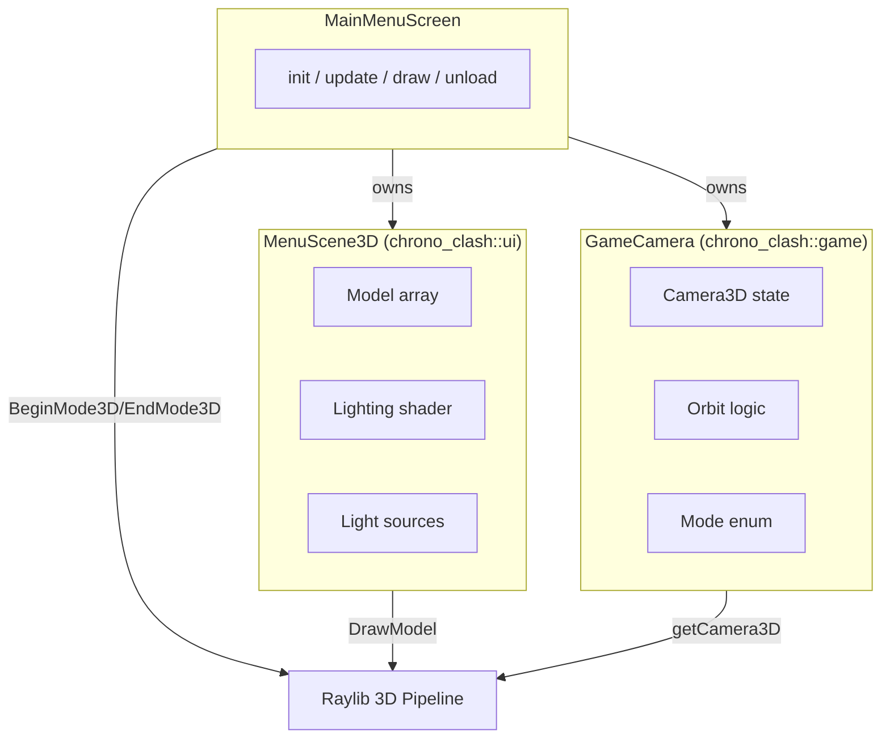
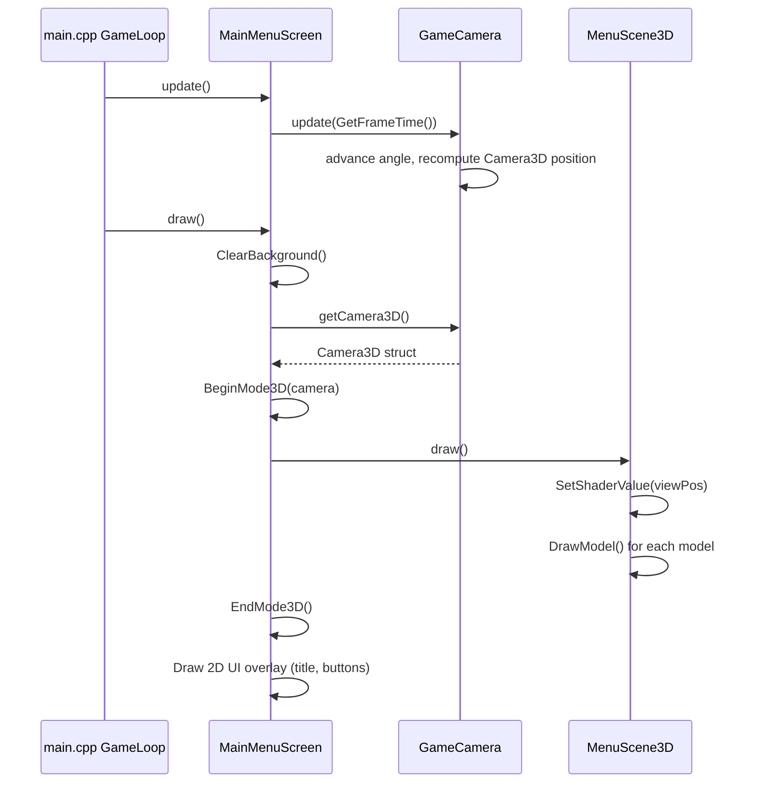

# Design Document: Menu 3D Models

## Overview

This feature introduces a 3D background scene to the ChronoClash main menu by adding two new classes — `GameCamera` (orbital camera controller) and `MenuScene3D` (3D model/lighting manager) — and integrating them into the existing `MainMenuScreen`. The 2D UI overlay (title, buttons, audio) remains unchanged and renders on top of the 3D scene.

The design prioritizes:
- **Reusability**: `GameCamera` supports multiple modes (Orbit, Follow, Pan) for use across menu and gameplay.
- **Cross-platform rendering**: Shader strategy uses Raylib's built-in `rlights.h` pattern with dual GLSL 330/100 shaders.
- **Graceful fallback**: Missing model assets produce placeholder geometry instead of crashes.
- **Framerate independence**: Camera movement is driven purely by delta-time accumulation.

## Architecture



### Data Flow (per frame)



## Components and Interfaces

### GameCamera (chrono_clash::game)

```cpp
namespace chrono_clash::game {

enum class CameraMode { Orbit, Follow, Pan };

class GameCamera {
public:
    GameCamera();

    /// Initialize with orbit/follow parameters. Clamps out-of-range values.
    void init(Vector3 target, float distance, float height, float speed, float fovy);

    /// Advance camera state by dt seconds (clamped to [0, 0.1]).
    void update(float dt);

    /// Get the current Raylib Camera3D (safe defaults if init() not called).
    Camera3D getCamera3D() const;

    /// Change active mode.
    void setMode(CameraMode mode);
    CameraMode getMode() const;

    /// Read current orbital angle (radians, [0, 2π)).
    float getAngle() const;

private:
    Camera3D camera_;
    CameraMode mode_;
    Vector3 target_;
    float distance_;
    float height_;
    float speed_;       // radians per second
    float angle_;       // current orbital angle in [0, 2π)
    bool initialized_;

    void recomputePosition();
};

} // namespace chrono_clash::game
```

**Key behaviors:**
- Constructor sets `initialized_ = false` and prepares safe defaults.
- `init()` clamps parameters: distance ∈ [1.0, 100.0], height ∈ [-50.0, 50.0], speed ∈ [0.01, 10.0], fovy ∈ [10.0, 120.0].
- `update(dt)`: ignores dt ≤ 0, clamps dt > 0.1 to 0.1, then advances `angle_ += speed_ * dt` with modulo 2π wrap.
- `getCamera3D()`: returns `camera_` (always valid — populated with defaults or init values).
- `recomputePosition()`: applies `x = target.x + distance * cos(angle)`, `z = target.z + distance * sin(angle)`, `y = target.y + height`.

### MenuScene3D (chrono_clash::ui)

```cpp
namespace chrono_clash::ui {

struct ModelTransform {
    Vector3 position;
    Vector3 rotation;   // Euler angles in degrees
    float scale;
};

struct ModelEntry {
    const char* filePath;   // relative to assets/models/
    ModelTransform transform;
};

class MenuScene3D {
public:
    MenuScene3D();
    ~MenuScene3D();

    /// Load models and lighting shader. Generates fallback cubes for missing files.
    void init(const ModelEntry* entries, int count);

    /// Render all models with lighting.
    void draw(Vector3 cameraPosition);

    /// Release all GPU resources (models, meshes, shader).
    void unload();

private:
    static constexpr int MAX_MODELS = 10;

    Model models_[MAX_MODELS];
    ModelTransform transforms_[MAX_MODELS];
    int modelCount_;

    Shader lightingShader_;
    int viewPosLoc_;
    int ambientLoc_;
    Light lights_[4];       // rlights.h Light struct
    int lightCount_;

    bool initialized_;

    void loadShader();
    Model loadModelOrFallback(const char* path);
};

} // namespace chrono_clash::ui
```

**Key behaviors:**
- `init()`: Caps count to MAX_MODELS. Loads shader pair (GLSL 330 or 100 based on platform). Creates lights via `CreateLight()`. Loads each model or generates `GenMeshCube(1,1,1)` as fallback. Assigns shader to all model materials.
- `draw(cameraPosition)`: Returns early if not initialized. Sets `viewPos` uniform. Iterates models, applies transform via Raylib's `DrawModelEx()`.
- `unload()`: Unloads each model, unloads shader, resets state. After unload, `draw()` is a no-op.

### Integration into MainMenuScreen

The existing `MainMenuScreen` gains two new members:

```cpp
// Added to MainMenuScreen private section:
chrono_clash::game::GameCamera camera3D_;
chrono_clash::ui::MenuScene3D scene3D_;
```

**Modified lifecycle:**

| Method | Change |
|--------|--------|
| `init()` | Also calls `camera3D_.init(...)` and `scene3D_.init(...)` after existing resource loading |
| `update()` | Also calls `camera3D_.update(GetFrameTime())` |
| `draw()` | Inserts 3D block before 2D UI: `BeginMode3D(camera3D_.getCamera3D())` → `scene3D_.draw(...)` → `EndMode3D()` |
| `unload()` | Also calls `scene3D_.unload()` |

The 2D UI elements (title, subtitle, buttons) continue drawing after `EndMode3D()` exactly as before. Semi-transparent backgrounds behind text/buttons ensure legibility over the 3D scene.

## Data Models

### CameraMode Enum

| Value | Behavior | Used In |
|-------|----------|---------|
| `Orbit` | Rotate around target at fixed distance/height | Menu screen |
| `Follow` | Track a moving target (future gameplay) | Gameplay (future) |
| `Pan` | Linear movement along a path (future) | Cinematics (future) |

### ModelTransform

| Field | Type | Description |
|-------|------|-------------|
| `position` | `Vector3` | World-space position |
| `rotation` | `Vector3` | Euler angles (degrees), applied as X→Y→Z rotation |
| `scale` | `float` | Uniform scale factor (> 0) |

### ModelEntry (init-time descriptor)

| Field | Type | Description |
|-------|------|-------------|
| `filePath` | `const char*` | Path relative to `assets/models/` (e.g., `"pedestal.glb"`) |
| `transform` | `ModelTransform` | Initial position, rotation, scale for this model |

### Shader Strategy

Raylib's official `rlights.h` (single-header, zlib-licensed) provides `CreateLight()` and `UpdateLightValues()` for managing up to 4 dynamic lights. The lighting shaders shipped with raylib examples provide matching GLSL code:

| Target | Vertex Shader | Fragment Shader |
|--------|---------------|-----------------|
| Desktop (OpenGL 3.3) | `lighting.vs` (GLSL 330) | `lighting.fs` (GLSL 330) |
| Web (OpenGL ES 2.0) | `lighting.vs` (GLSL 100) | `lighting.fs` (GLSL 100) |

**Platform selection at runtime:**

```cpp
void MenuScene3D::loadShader() {
#if defined(PLATFORM_WEB) || defined(EMSCRIPTEN)
    lightingShader_ = LoadShader("assets/shaders/lighting100.vs",
                                  "assets/shaders/lighting100.fs");
#else
    lightingShader_ = LoadShader("assets/shaders/lighting330.vs",
                                  "assets/shaders/lighting330.fs");
#endif
    // Get shader locations
    lightingShader_.locs[SHADER_LOC_VECTOR_VIEW] = GetShaderLocation(lightingShader_, "viewPos");
    ambientLoc_ = GetShaderLocation(lightingShader_, "ambient");

    // Set ambient light
    float ambient[4] = {0.2f, 0.2f, 0.2f, 1.0f};
    SetShaderValue(lightingShader_, ambientLoc_, ambient, SHADER_UNIFORM_VEC4);
}
```

The shader files are placed in `client/assets/shaders/` and bundled via the existing `--preload-file` mechanism for Emscripten builds.

### Default Menu Scene Configuration

```cpp
static const ModelEntry MENU_MODELS[] = {
    {"pedestal.glb",   {{0.0f, -1.0f, 0.0f}, {0.0f, 0.0f, 0.0f}, 1.0f}},
    {"character.glb",  {{0.0f,  0.5f, 0.0f}, {0.0f, 0.0f, 0.0f}, 1.0f}},
};

// Camera config for menu
camera3D_.init(
    {0.0f, 0.0f, 0.0f},   // target: origin
    8.0f,                   // distance: 8 world units
    3.0f,                   // height: 3 units above target
    0.3f,                   // speed: 0.3 rad/s (~19°/s, full orbit in ~21s)
    45.0f                   // fovy: 45 degrees
);
```

### Light Configuration

A single directional light simulating a key light, plus a secondary fill light:

| Light | Type | Position | Target | Color |
|-------|------|----------|--------|-------|
| Key | Directional | (5, 8, 5) | (0, 0, 0) | White (255, 255, 255) |
| Fill | Point | (-3, 4, -3) | (0, 0, 0) | Soft blue (100, 100, 200) |

## Correctness Properties

*A property is a characteristic or behavior that should hold true across all valid executions of a system — essentially, a formal statement about what the system should do. Properties serve as the bridge between human-readable specifications and machine-verifiable correctness guarantees.*

### Property 1: Camera3D struct validity after init

*For any* valid combination of target (any Vector3), distance ∈ [1.0, 100.0], height ∈ [-50.0, 50.0], speed ∈ [0.01, 10.0], and fovy ∈ [10.0, 120.0], calling `init()` followed by `getCamera3D()` SHALL return a Camera3D with projection = CAMERA_PERSPECTIVE, up = (0, 1, 0), fovy equal to the input fovy, and camera position at Euclidean distance equal to the configured distance from the target (±0.01).

**Validates: Requirements 1.3, 1.4**

### Property 2: Orbit position invariant

*For any* GameCamera in Orbit mode, at any point during execution (after any sequence of update(dt) calls with valid dt values), the camera position SHALL satisfy: `sqrt((cam.x - target.x)² + (cam.z - target.z)²) == distance` (±0.01) AND `cam.y == target.y + height` AND `Camera3D.target == configured target`.

**Validates: Requirements 2.1, 2.2, 2.3, 2.6**

### Property 3: Parameter clamping

*For any* input parameters where distance, height, speed, or fovy fall outside their valid ranges, calling `init()` SHALL produce an internal state equivalent to calling `init()` with those parameters clamped to [1.0, 100.0], [-50.0, 50.0], [0.01, 10.0], and [10.0, 120.0] respectively.

**Validates: Requirements 1.5**

### Property 4: Update additivity (framerate independence)

*For any* sequence of positive delta-time values dt₁, dt₂, ..., dtₙ each ≤ 0.1, calling `update(dt₁)` then `update(dt₂)` ... then `update(dtₙ)` SHALL produce the same camera state as a single call `update(dt₁ + dt₂ + ... + dtₙ)` (when the sum also ≤ 0.1), demonstrating that camera movement is purely a function of accumulated time.

**Validates: Requirements 3.2**

### Property 5: Angle wrapping invariant

*For any* sequence of update calls that cause the cumulative angle to exceed 2π, the stored orbital angle SHALL always remain in the range [0, 2π), preventing unbounded growth.

**Validates: Requirements 2.5**

### Property 6: Delta-time clamping

*For any* dt value greater than 0.1 seconds, calling `update(dt)` SHALL produce the same state change as calling `update(0.1)`, ensuring large frame spikes do not cause discontinuous jumps.

**Validates: Requirements 3.4**

## Error Handling

| Scenario | Component | Behavior |
|----------|-----------|----------|
| `getCamera3D()` before `init()` | GameCamera | Returns safe defaults (distance=10, height=5, fovy=45, target=origin, mode=Orbit) |
| `update(dt ≤ 0)` | GameCamera | No-op, state unchanged |
| `update(dt > 0.1)` | GameCamera | Clamps dt to 0.1 |
| `init()` params out of range | GameCamera | Clamps each parameter to valid bounds |
| Model file not found | MenuScene3D | Generates 1×1×1 cube placeholder with same transform |
| `LoadModel()` returns meshCount=0 | MenuScene3D | Treats as missing, generates cube fallback |
| `draw()` before `init()` | MenuScene3D | Returns immediately, no draw calls |
| `draw()` after `unload()` | MenuScene3D | Returns immediately, no draw calls |
| Model count > 10 | MenuScene3D | Ignores entries beyond MAX_MODELS (10) |
| Shader load failure | MenuScene3D | Falls back to Raylib's default unlit rendering (no shader assigned) |

## Testing Strategy

### Unit Tests (GameCamera)

GameCamera is a pure-logic component with no GPU dependencies — its `update()` and `getCamera3D()` methods are deterministic functions of input parameters and delta-time. This makes it ideal for property-based testing.

**Framework**: A lightweight C++ PBT framework (e.g., [RapidCheck](https://github.com/emil-e/rapidcheck)) or custom generators with random inputs and assertions.

**Property-based tests** (minimum 100 iterations each):
- Feature: menu-3d-models, Property 1: Camera3D struct validity after init
- Feature: menu-3d-models, Property 2: Orbit position invariant
- Feature: menu-3d-models, Property 3: Parameter clamping
- Feature: menu-3d-models, Property 4: Update additivity
- Feature: menu-3d-models, Property 5: Angle wrapping invariant
- Feature: menu-3d-models, Property 6: Delta-time clamping

**Example-based unit tests**:
- Default mode is Orbit after construction
- `getCamera3D()` returns safe defaults before `init()`
- `update(0)` causes no state change
- `update(-1.0)` causes no state change

### Integration Tests (MenuScene3D + MainMenuScreen)

These require a Raylib rendering context and verify:
- Model loading with valid .glb files
- Fallback cube generation for missing files
- Shader loads on both OpenGL 3.3 and ES 2.0 paths
- Correct render order (3D before 2D)
- Button hover/click detection remains functional over 3D background
- `unload()` releases all GPU resources without crashes

### Build Smoke Tests

- Native build compiles with zero errors
- Emscripten build compiles with zero errors
- Resulting binaries launch without crashes/WebGL errors

### Test Dependencies

| Test Layer | Requires Raylib Window | Requires GPU | Requires Assets |
|------------|----------------------|--------------|-----------------|
| GameCamera PBT | No | No | No |
| GameCamera unit | No | No | No |
| MenuScene3D integration | Yes | Yes | Yes (or fallbacks) |
| MainMenuScreen integration | Yes | Yes | Yes |
| Build smoke | Build system | Platform-dependent | Yes |
