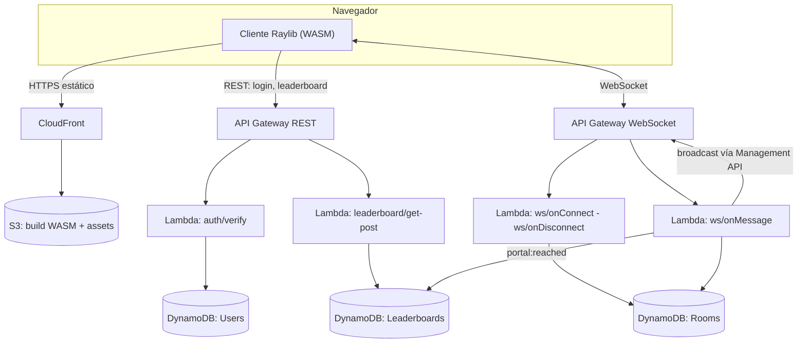

# ChronoClash — Stack Tecnológico y Arquitectura

## Stack principal

| Capa | Tecnología | Notas |
|------|-----------|-------|
| Cliente (juego) | C++ + Raylib 5.x | Compilado a WASM con Emscripten (`em++`) |
| Build web | Emscripten (em++) | Target `PLATFORM_WEB`, genera `.html`, `.js`, `.wasm` |
| Hosting estático | S3 + CloudFront | Build WASM + assets servidos vía CDN |
| Auth | Google Identity Services | ID token verificado server-side (campo `sub` como ID único) |
| API REST | API Gateway (HTTP API) + Lambda | Login, leaderboard |
| API WebSocket | API Gateway WebSocket + Lambda | Eventos de partida en tiempo real |
| Base de datos | DynamoDB (modo on-demand) | Tablas: Users, Rooms, Leaderboards |
| Infra-as-Code | AWS SAM o CDK (a definir) | Deploy de Lambdas + API Gateways + tablas |

## Decisiones de arquitectura

### Auth sin Cognito

- El cliente inicia sesión con **Google Identity Services** (botón "Sign In with Google" en HTML overlay o popup).
- El ID token (JWT) se envía al backend (Lambda `auth/verify`).
- La Lambda valida el token contra las claves públicas de Google (`https://www.googleapis.com/oauth2/v3/certs`), extrae el campo `sub` como identificador único y `name`/`email` para display.
- Se crea o actualiza el registro en la tabla `Users`.
- Se devuelve un session token propio (JWT firmado por el backend) que el cliente usa en llamadas subsiguientes.
- **Razón:** Cognito añade complejidad innecesaria para un solo proveedor. Verificar el ID token directamente es más simple y sin costo adicional.

### Sincronización de red por eventos (no por tick)

- **Cliente-autoritativo para movimiento propio:** cada cliente ejecuta su física localmente con predicción. No se envía posición por tick al servidor.
- **Servidor-autoritativo para eventos discretos:**
  - `ability:activate` / `ability:deactivate` — inicio/fin de Time Bubble.
  - `damage:hit` — un jugador recibe impacto (servidor valida proximidad a peligro).
  - `checkpoint:reached` — un jugador alcanza un checkpoint.
  - `portal:reached` — un jugador llega al portal (resuelve la partida).
- El servidor broadcast los eventos relevantes a los 4 jugadores de la sala.
- **Razón:** reducir invocaciones Lambda y costos de API Gateway WebSocket. A este volumen, permanecemos dentro del free tier.

### Anti-cheat básico

- El servidor mantiene un **cronómetro de partida** (timestamp de inicio en la tabla `Rooms`).
- Los checkpoints y la llegada al portal se validan comparando timestamps de eventos previos (no es posible "saltar" checkpoints).
- El Leaderboard se escribe **solo desde Lambda**, nunca desde el cliente.
- **Razón:** para un hackathon, basta con que el servidor sea fuente de verdad del progreso; no se necesita validación tick-a-tick de posición.

### DynamoDB on-demand

- Modo **on-demand** (pay-per-request): no requiere provisionar RCU/WCU.
- A bajo volumen (hackathon/demo), el costo es prácticamente nulo.
- Nota: el free tier clásico de 25 RCU / 25 WCU aplica solo a modo provisioned. On-demand tiene su propia capa gratuita temporal para cuentas nuevas.

### Generación de niveles

- Salas/bloques prediseñados como archivos de datos (JSON) con geometría 3D (posiciones, bounding boxes, meshes de referencia).
- Se encadenan en un grafo lineal hacia el portal.
- El servidor selecciona la secuencia al crear la sala y la envía al cliente al conectarse.
- El cliente carga modelos 3D y posiciona objetos según los datos del bloque.
- **Razón:** el enfoque más sencillo de implementar en Raylib 3D sin generación procedural compleja.

## Diagrama de arquitectura



## Esquema de tablas DynamoDB

### Tabla: Users

| Atributo | Tipo | Clave | Descripción |
|----------|------|-------|-------------|
| `userId` | S | PK | `sub` del Google ID token |
| `displayName` | S | — | Nombre visible del jugador |
| `email` | S | — | Email de Google (opcional, para referencia) |
| `createdAt` | N | — | Epoch ms de creación |
| `lastLogin` | N | — | Epoch ms de último login |

### Tabla: Rooms

| Atributo | Tipo | Clave | Descripción |
|----------|------|-------|-------------|
| `roomId` | S | PK | UUID de la sala |
| `status` | S | — | `waiting` / `playing` / `finished` |
| `players` | L | — | Lista de objetos `{userId, team, connectionId, checkpoints[]}` |
| `levelSequence` | L | — | IDs de bloques que componen el nivel |
| `startedAt` | N | — | Epoch ms del inicio de carrera |
| `winnerId` | S | — | `team` ganador (si `status=finished`) |
| `ttl` | N | — | TTL para auto-expiración de salas terminadas |

### Tabla: Leaderboards

| Atributo | Tipo | Clave | Descripción |
|----------|------|-------|-------------|
| `boardId` | S | PK | Identificador del leaderboard (ej. `global`) |
| `score` | N | SK | Tiempo de finalización en ms (menor = mejor) |
| `userId` | S | — | `userId` del jugador |
| `displayName` | S | — | Nombre visible (desnormalizado para lectura rápida) |
| `roomId` | S | — | Sala donde se logró el tiempo |
| `achievedAt` | N | — | Epoch ms |

> Nota: el SK numérico permite queries ordenadas por mejor tiempo con `ScanIndexForward=true`.

## Rutas WebSocket (routes)

| Ruta | Dirección | Payload clave | Descripción |
|------|-----------|---------------|-------------|
| `$connect` | C→S | query: `token` | Autenticación al conectar |
| `$disconnect` | C→S | — | Limpieza de conexión |
| `room:join` | C→S | `{roomId?}` | Unirse o crear sala |
| `room:ready` | C→S | `{}` | Jugador listo |
| `room:start` | S→C | `{levelSequence, players}` | Partida inicia (broadcast) |
| `ability:activate` | C→S | `{position}` | Jugador activa Time Bubble |
| `ability:deactivate` | C→S | `{}` | Jugador desactiva Time Bubble |
| `ability:state` | S→C | `{userId, active, position}` | Broadcast estado de burbuja |
| `damage:hit` | C→S | `{hazardId, position}` | Jugador reporta impacto |
| `damage:death` | S→C | `{userId, respawnCheckpoint}` | Broadcast muerte + respawn |
| `checkpoint:reached` | C→S | `{checkpointId}` | Jugador alcanza checkpoint |
| `checkpoint:confirmed` | S→C | `{userId, checkpointId}` | Servidor confirma checkpoint |
| `portal:reached` | C→S | `{}` | Jugador llega al portal |
| `portal:winner` | S→C | `{team, time}` | Broadcast fin de partida |

## Comandos de build (cliente)

### Requisitos previos

- Emscripten SDK (emsdk) instalado y activado (`source emsdk_env.sh` o equivalente).
- Raylib 5.x descargado (se compila junto al proyecto, con soporte 3D/OpenGL ES 2.0 para web).

### Build para web

```bash
# Desde la raíz del proyecto
cd client

# Compilar raylib para web (una sola vez)
make -C lib/raylib/src PLATFORM=PLATFORM_WEB -B

# Compilar el juego (C++)
em++ -o build/index.html src/main.cpp src/game/*.cpp src/net/*.cpp src/ui/*.cpp \
  -I lib/raylib/src \
  -L lib/raylib/src \
  -lraylib \
  -s USE_GLFW=3 \
  -s ASYNCIFY \
  -s TOTAL_MEMORY=67108864 \
  -s ALLOW_MEMORY_GROWTH=1 \
  --preload-file assets \
  --shell-file src/shell.html \
  -DPLATFORM_WEB \
  -std=c++17
```

### Build nativo (desarrollo local)

```bash
cd client
g++ -o build/chronoclash src/main.cpp src/game/*.cpp src/net/*.cpp src/ui/*.cpp \
  -I lib/raylib/src \
  -L lib/raylib/src \
  -lraylib -lm -lpthread -ldl -lrt -lX11 \
  -std=c++17
```

### Deploy

```bash
# Subir build web a S3
aws s3 sync client/build/ s3://chronoclash-web/ --delete

# Invalidar cache de CloudFront
aws cloudfront create-invalidation --distribution-id $DIST_ID --paths "/*"
```

### Backend (Lambdas)

```bash
cd backend

# Instalar dependencias
npm install

# Deploy con SAM
sam build
sam deploy --guided
```
